# smart-plate-heater

A weight-based, smart plate heater for ease of use and safety

- The posh wooden plate that the user sees !

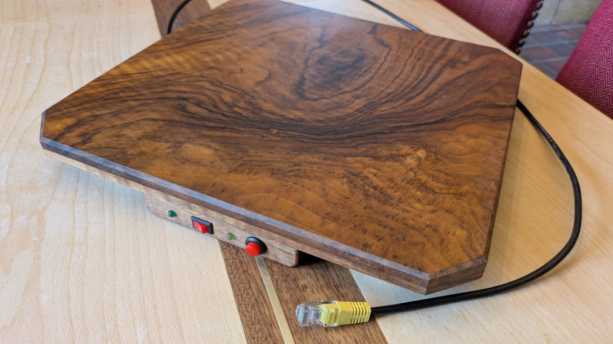

- The back "measuring foot"
  - holding all the wieght in a 3-points-of-contact setup
  - maximum 5kg vertically on the back, so an average of 10kg in center
  - the back feet do nothing except prevent tumbling

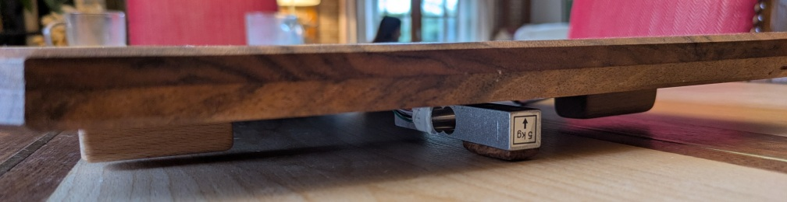

- due to the sensitivity of the voltages used for measuring using a strain gauge, the pre-processing must be done locally... plus the panel can be done locally too and everything fits in the 8 wires of the network cable

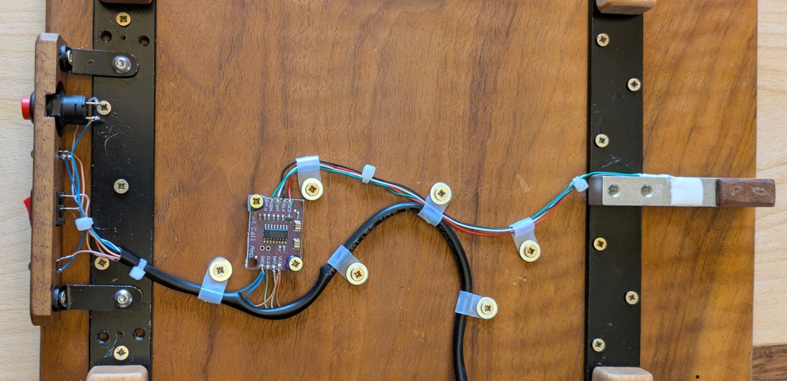

The target "perfboard pcb", with only 3 additional wires (solid core, 26 AWG, ptfe isolated wires)

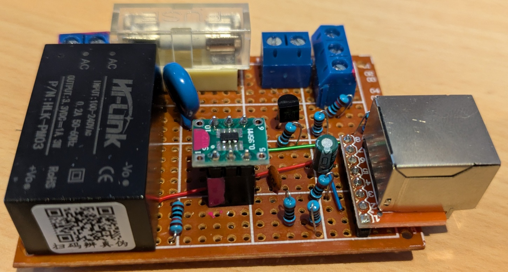

Only 3 shrink fit insulation patches, where i forgot to make multi-level "manhattan-style" routing

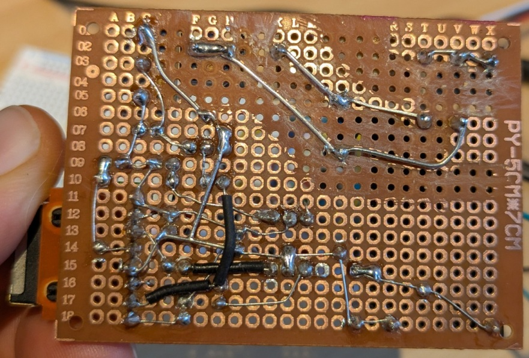

## Schematic and "perfboard" PCB

The way the main board works and AC safety is done in the derivation box

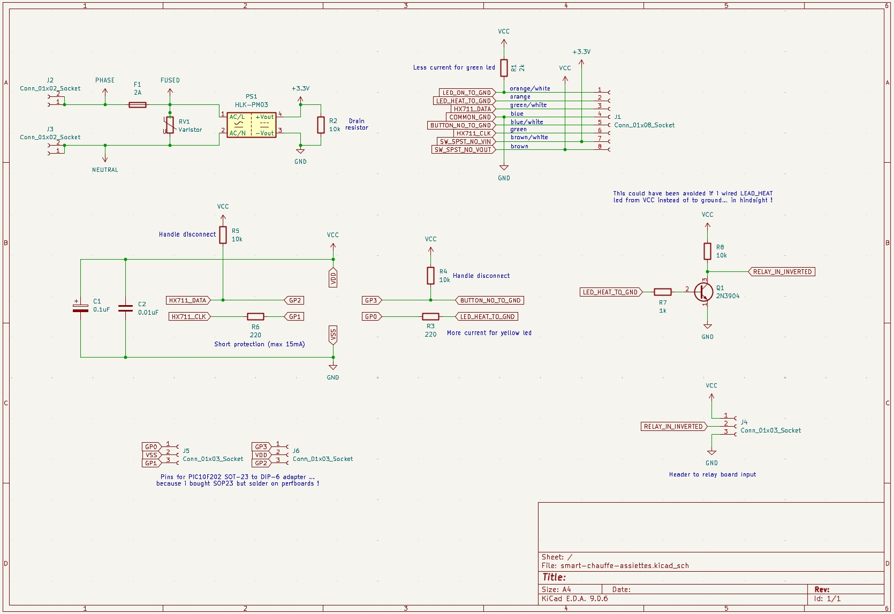

I always prepare my perfboard routing on a appropriately sized PCB

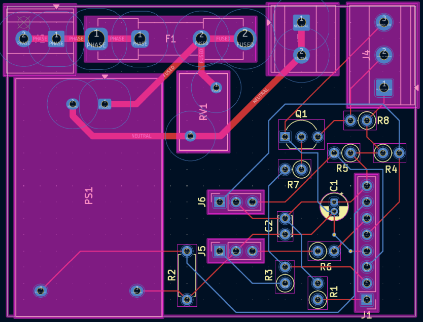

The way the appliance and user panel is wired

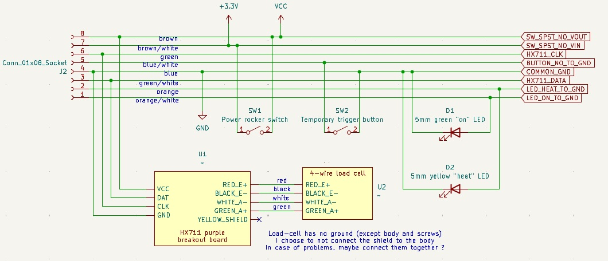

## Hardware

Target board on perfboard (uses 8mA@3V3 at idle and 80ma@3V3 when relay is on)

- PIC 10F200-family microcontroller (here a 202 in SOP-23 a DIP breakout board) from rs-online.com

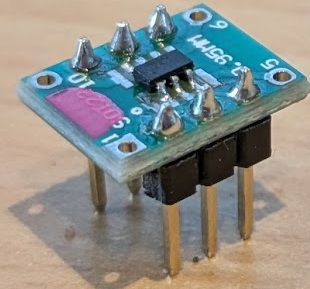

- 500mA 5x20 fuse and fuse holder (oversized, the whole thing draws less than 0.35 W at full load)

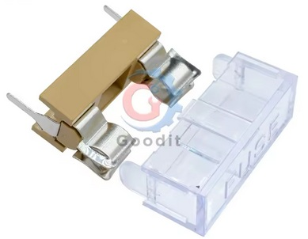

- varistor 10D561K (transient voltage suppressor TVS) ot protect the circuit from grid surges

- HLK-PM03 3W 240VAC to 3.3VDC converter (isolated)

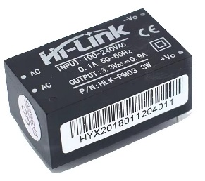

- HX711 breakout board (purple with holes for fixturing

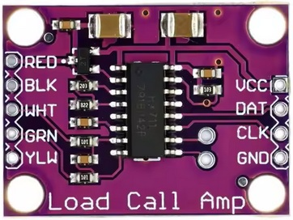

- Beam-type load cell (maximum 5KG)

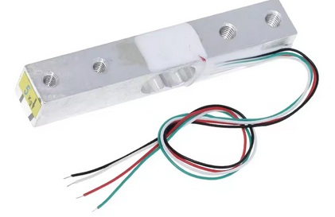

- 3.3V relay board (active low, floating high)

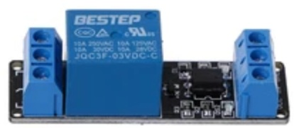

- network port breakout board, and a network cable to cut

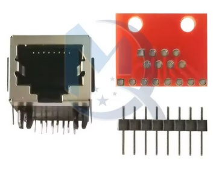

- normally open temporary button, single pole single throw (SPST) rocker switch...
- screw terminals, 1/4W resistors, 5mm LED, headers,dc caps, 2N3904 NPN transitor...

For prototyping

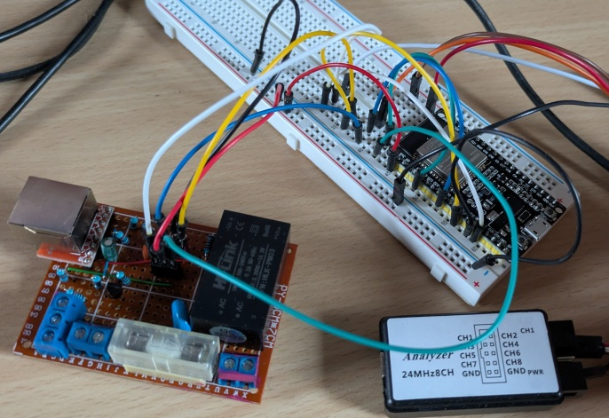

- breadboard and dupont cables
- ESP32 DevKit 38 pins

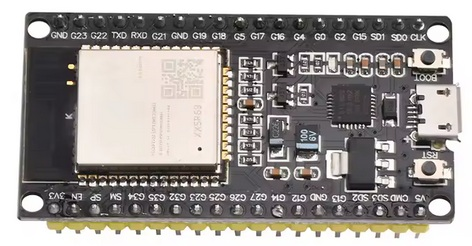

- logic analyzer (salae clone)

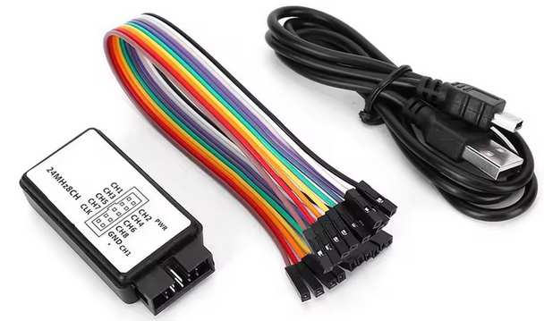

Real wafeforms results in PulseView software from ESP prototype

- Macro waveforms to see sampling rate of HX711 breakout board (1 sample per 0.4 second = 2.5 Hz)

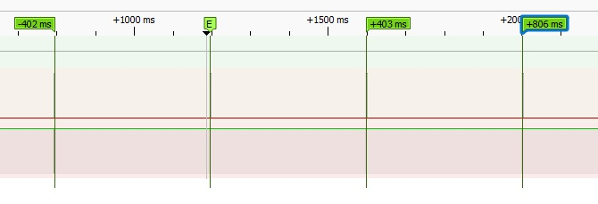

- Micro waveforms to check the clock and data timings (data transfer time is 115 micro-seconds)

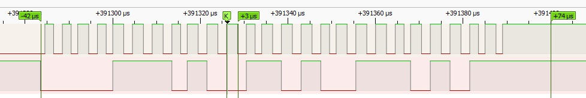

## Pinouts

Using a PIC10F202 as microcontroller

Target perfboard using PIC10F202 SOT-23-to-DIP pinout

    PIN 1 = GP0 = OUT_HEAT  PIN 6 = GP3 = IN_BUTTON
    PIN 2 = VSS (-)         PIN 5 = VDD (+)
    PIN 3 = GP1 = OUT_CLK   PIN 4 = GP2 = IN_DATA

Arduino prototype on ESP32 DevKit pinout

    G14 = OUT_HEAT
    G25 = OUT_CLOCK
    G13 = IN_DATA
    G34 = IN_BUTTON

## kicad folder

Design for electronics and target solderboard in a box

## mplab.x folder

PIC IDE, and C code built with XC8 compiler to generate HEX file

- [Pre-compiled HEX file for a PIC10F202 microcontroller](mplab.X/pic10f202-production.hex)
- which you can program using my homemade [Arduino-UNO-based simple pic programmer](https://github.com/nipil/arduino-simple-pic-programmer)

### Debugging

Go to `Tools/Options/Embedded`

- debug reset `reset vector`
- debug startup `halt at reset vector`
- activate stimulus (*.scl) file
- use simulator to debug

### Chip fuses

Go to `Window/Target Memory View/Configuration bits`

- disable MCLRE to be able to use GP3

## arduino-esp-prototype-software folder

This is an archived folder for an arduino framework, ESP32-devboard-based prototype

Achieved goals :

- verify that everything works on 3.3V
- discover raw values for "empty" aparatus
- discover raw values for "edge" beam strain gage
- discover effect of the weight of the cable (!)
- discover the "one kilogram on center" desired threshold
- verify light / transistor / relay working when desired
- verify values upon cable disconnection
- verify disconnection disabling
- verify negative/zero HX711 values disabling
- verify reset conditions disabling
- verify heat triggering by button when above threshold
- verify heat disabling when going under threshold
